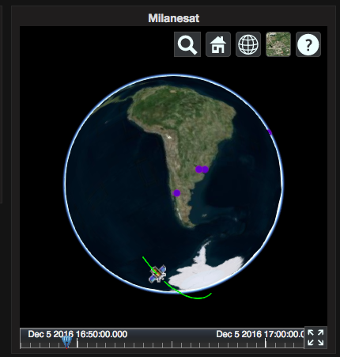

# Grafana Plugins - 3D Globe Panel 

*20 June 2022. Update: 2022/07/06.*

* [用途](#use)

* [安裝方式、有無支援 ElasticSearch](#install)

* [範例](#example)

<h2 id="use">用途</h2>

能放入資料在地圖上顯示地點 (需使用CZML)

<h2 id="install">安裝方式、有無支援 ElasticSearch</h2>

搜尋 Grafana Plugins 中的 3D Globe Panel 並點擊 INSTALL 或打以下指令

    grafana-cli plugins install satellogic-3d-globe-panel

*不支援 ES*

<h2 id="example">範例</h2>

