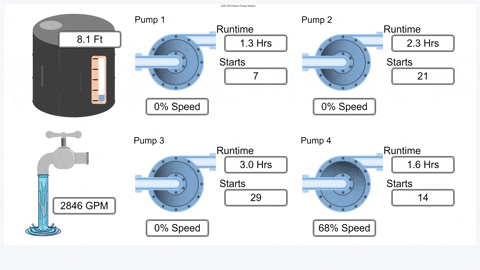

# Grafana Plugins - ACE.SVG 

*20 June 2022. Update: 2022/07/25.*

* [用途](#use)

* [安裝方式、有無支援 ElasticSearch](#install)

* [範例](#example)

* [研究進度](#research)

<h2 id="use">用途</h2>

在對應圖片上顯示可視化的數據

<h2 id="install">安裝方式、有無支援 ElasticSearch</h2>

搜尋 Grafana Plugins 中的 ACE.SVG 並點擊 INSTALL 或打以下指令

    grafana-cli plugins install aceiot-svg-panel

<h2 id="example">範例</h2>

<h2 id="research">研究進度</h2>

因為要寫 js 較難產出圖表

如果是想要有圖片的話，Flowcharting也可插入圖片在drawio後再匯入跟搭配Grafana做動畫。
