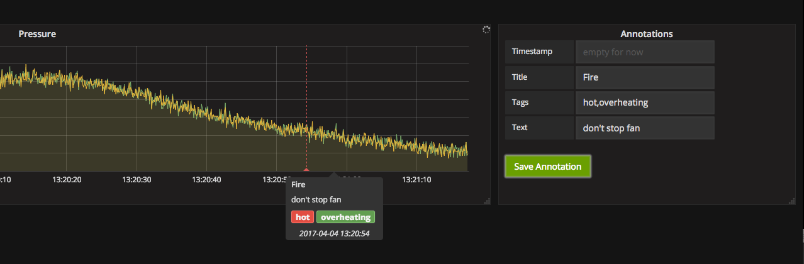

# Grafana Plugins - Annotation Panel

*20 June 2022. Update: 2022/06/23.*

* [用途](#use)

* [安裝方式、有無支援 ElasticSearch](#install)

* [範例](#example)

<h2 id="use">用途</h2>

可在 InfluxDB 數據庫中保存註釋，是一種在圖形上標記點的方法

<h2 id="install">安裝方式、有無支援 ElasticSearch</h2>

(已包含在grafana裡，不需安裝)

*並未支援 ElasticSearch，只適用 InfluxDB 數據源*

<h2 id="example">範例</h2>

