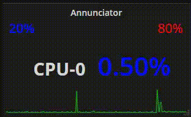

# Grafana Plugins - Annunciator

*20 June 2022. Update: 2022/07/06.*

* [用途](#use)

* [安裝方式、有無支援 ElasticSearch](#install)

* [範例](#example)

<h2 id="use">用途</h2>

適合觀察帶有時間變化的資料 (EX:監控CPU使用率)，並可設定閥值上下限及警示

<h2 id="install">安裝方式、有無支援 ElasticSearch</h2>

搜尋 Grafana Plugins 中的 Annunciator 並點擊 INSTALL 或打以下指令

    grafana-cli plugins install michaeldmoore-annunciator-panel

<h2 id="example">範例</h2>

