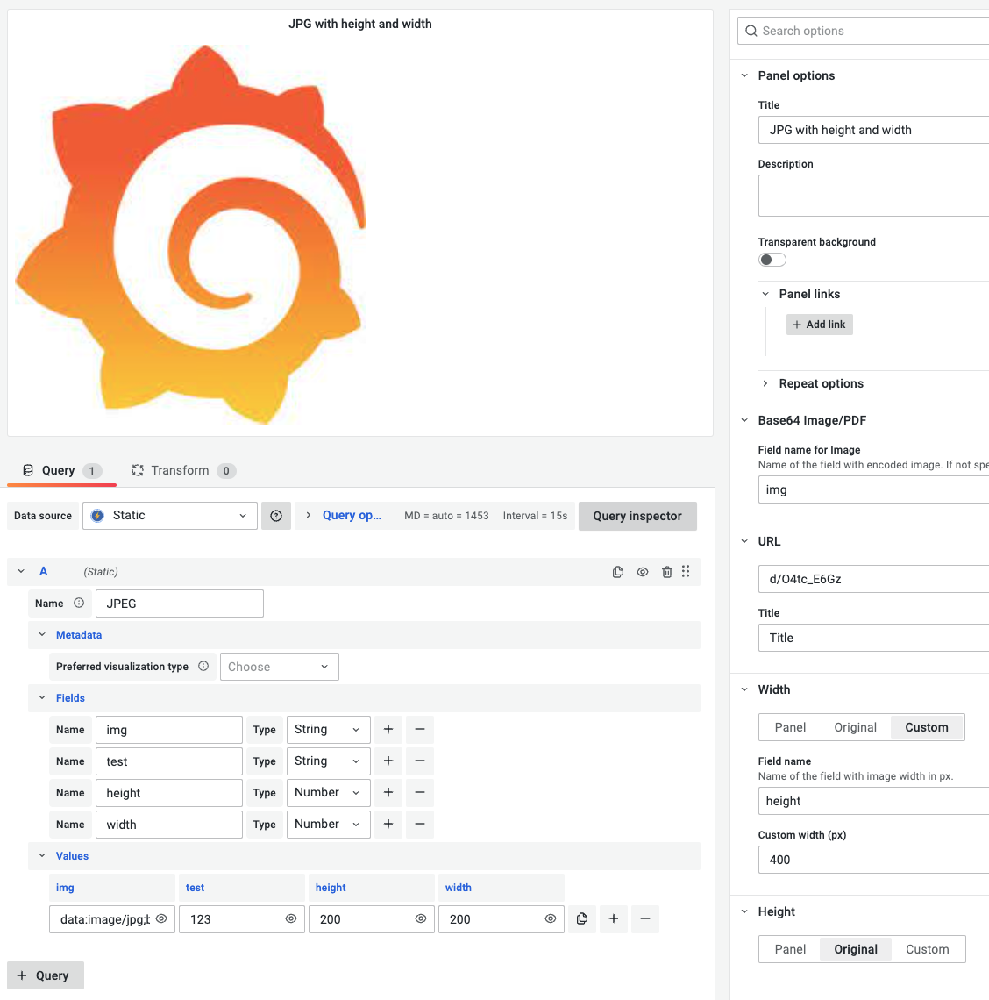

# Grafana Plugins - Base64 Image/Video/Audio/PDF

*20 June 2022. Update: 2022/06/28.*

* [用途](#use)

* [安裝方式、有無支援 ElasticSearch](#install)

* [範例](#example)

<h2 id="use">用途</h2>

可顯示 PNG、JPG、GIF、MP4、WEBM、MP3、OGG、PDF 格式的原始和 Base64 編碼文件。

<h2 id="install">安裝方式、有無支援 ElasticSearch</h2>

搜尋 Grafana Plugins 中的 Base64 Image/Video/Audio/PDF 並點擊 INSTALL 或打以下指令

    grafana-cli plugins install volkovlabs-image-panel

<h2 id="example">範例</h2>

