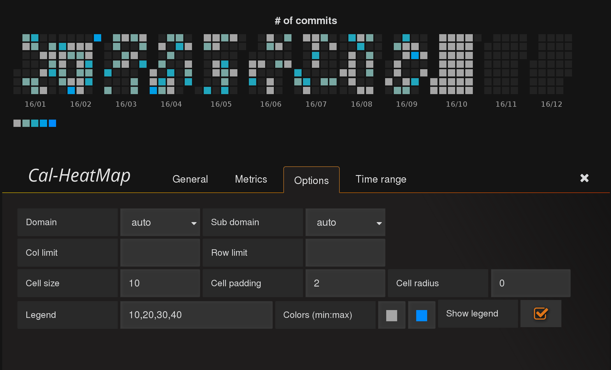

# Grafana Plugins - Cal-HeatMap 

*20 June 2022. Update: 2022/07/06.*

* [用途](#use)

* [安裝方式、有無支援 ElasticSearch](#install)

* [範例](#example)

<h2 id="use">用途</h2>

提供帶有顯示顏色區塊圖的日曆

<h2 id="install">安裝方式、有無支援 ElasticSearch</h2>

搜尋 Grafana Plugins 中的 Cal-HeatMap 並點擊 INSTALL 或打以下指令    

    grafana-cli plugins install neocat-cal-heatmap-panel

<h2 id="example">範例</h2>

