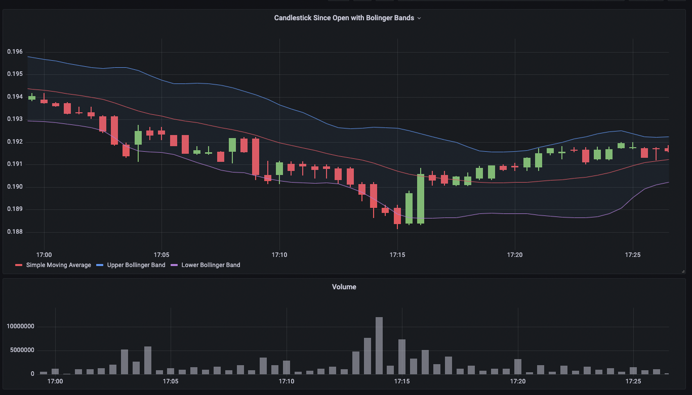
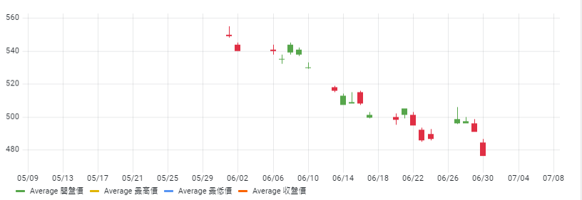

# Grafana Plugins - Candlestick

*20 June 2022. Update: 2022/06/30.*

* [用途](#use)

* [安裝方式、有無支援 ElasticSearch](#install)

* [範例](#example)

* [實作練習](#do_example)

<h2 id="use">用途</h2>

常用於描述證券、衍生品或貨幣的價格變動

<h2 id="install">安裝方式、有無支援 ElasticSearch</h2>

(已包含在grafana裡，不需安裝)

<h2 id="example">範例</h2>

<h2 id="do_example">實作練習</h2>

