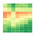

# Grafana Plugins - Carpet plot

*20 June 2022. Update: 2022/07/03.*

* [用途](#use)

* [安裝方式、有無支援 ElasticSearch](#install)

* [範例](#example)

<h2 id="use">用途</h2>

接收數據系列並將所有數據劃分為單獨的存儲桶，按天對數據進行分組，然後按一天的選定片段（小時/15 分鐘/分鐘）對數據進行分組

<h2 id="install">安裝方式、有無支援 ElasticSearch</h2>

搜尋 Grafana Plugins 中的 Carpet plot 並點擊 INSTALL 或打以下指令

    grafana-cli plugins install petrslavotinek-carpetplot-panel

<h2 id="example">範例</h2>

