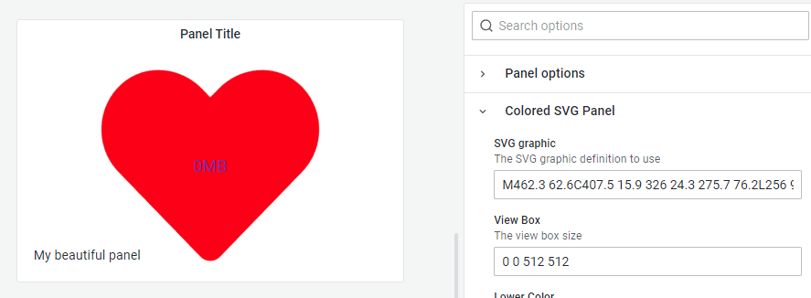

# Grafana Plugins - Colored SVG Panel

*20 June 2022. Update: 2022/06/28.*

* [用途](#use)

* [安裝方式、有無支援 ElasticSearch](#install)

* [範例](#example)

* [實作練習](#do_example)

<h2 id="use">用途</h2>

可自定義的閾值將數據顯示為彩色 svg

<h2 id="install">安裝方式、有無支援 ElasticSearch</h2>

搜尋 Grafana Plugins 中的 Colored SVG Panel 並點擊 INSTALL 或打以下指令

    grafana-cli plugins install snuids-svg-panel

<h2 id="example">範例</h2>

<h2 id="do_example">實作練習</h2>

