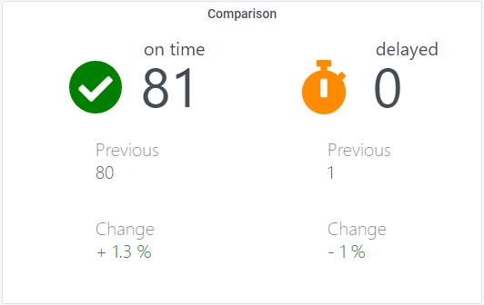

# Grafana Plugins - Comparison Panel 

*20 June 2022. Update: 2022/07/25.*

* [用途](#use)

* [安裝方式、有無支援 ElasticSearch](#install)

* [範例](#example)

* [研究進度](#research)

<h2 id="use">用途</h2>

顯示當前一組值與之前一組值的差異

<h2 id="install">安裝方式、有無支援 ElasticSearch</h2>

搜尋 Grafana Plugins 中的 Comparison Panel 並點擊 INSTALL 或打以下指令

    grafana-cli plugins install integrationmatters-comparison-panel

<h2 id="example">範例</h2>

<h2 id="research">研究進度</h2>

能改最上方的名稱，icon內的勾勾，icon背景顏色，但數值就是進不去，而且這兩組是寫死的，沒辦法新增更多比較

