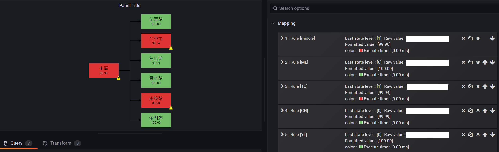

# Grafana Plugins - FlowCharting

*20 June 2022. Update: 2022/07/12.*

* [用途](#use)

* [安裝方式、有無支援 ElasticSearch](#install)

* [範例](#example)

* [實作範例](#do_example)

<h2 id="use">用途</h2>

繪製大範圍流程圖，為其提供實時數據並在流程圖中定義數據如何影響視覺反饋。

<h2 id="install">安裝方式、有無支援 ElasticSearch</h2>

搜尋 Grafana Plugins 中的 FlowCharting 並點擊 INSTALL 或打以下指令

    grafana-cli plugins install agenty-flowcharting-panel

<h2 id="example">範例</h2>

<h2 id="do_example">實作範例</h2>

範例製作者 [hsiaotingg](https://github.com/hsiaotingg/ELKG/blob/Grafana-plugins/flowcharting/teaching.md)

需先使用draw.io將需要的圖表畫出來，例如：系統監控圖、網路拓樸圖、技術架構圖等，都可以利用draw.io在線上快速製出圖表並匯出XML、PDF、PNG等類型。

flowcharting可以將draw.io產出圖表的各個元素綁定數據資料，再藉由設定不同閥值、搭配不同顏色，使用者一眼就能清楚地看出各個服務或裝置的狀態，提升排查除錯的效率。

