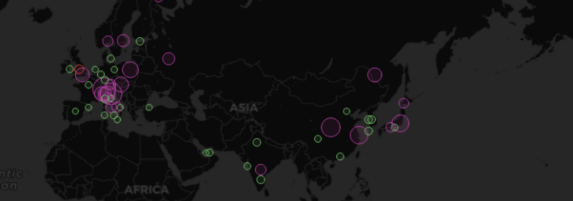

# Grafana Plugins - Geomap

*20 June 2022. Update: 2022/06/30.*

* [用途](#use)

* [安裝方式、有無支援 ElasticSearch](#install)

* [範例](#example)

<h2 id="use">用途</h2>

使用地理空間數據查看和自定義世界地圖，可以配置各種疊加樣式和地圖視圖設置 (需 GeoJSON 格式的資料，且有很多設定可以改)

<h2 id="install">安裝方式、有無支援 ElasticSearch</h2>

(已包含在grafana裡，不需安裝)

<h2 id="example">範例</h2>

