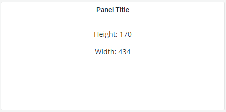

# Grafana Plugins - HTML graphics

*20 June 2022. Update: 2022/06/28.*

* [用途](#use)

* [安裝方式、有無支援 ElasticSearch](#install)

* [範例](#example)

<h2 id="use">用途</h2>

透過自行撰寫 HTML 或 SVG 來呈現圖

https://gapit-htmlgraphics-panel.gapit.io/ 此網站有更詳細的教學

<h2 id="install">安裝方式、有無支援 ElasticSearch</h2>

搜尋 Grafana Plugins 中的 HTML graphics 並點擊 INSTALL 或打以下指令

    grafana-cli plugins install gapit-htmlgraphics-panel

<h2 id="example">範例</h2>

依儀表板長寬動態變更長寬數字的例子

