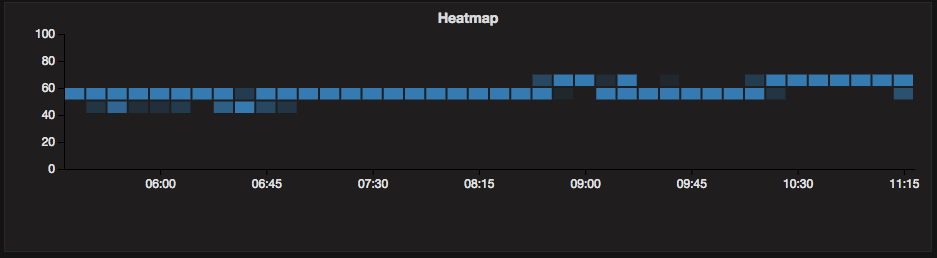

# Grafana Plugins - HeatmapEpoch 

*20 June 2022. Update: 2022/07/06.*

* [用途](#use)

* [安裝方式、有無支援 ElasticSearch](#install)

* [範例](#example)

<h2 id="use">用途</h2>

接收原始時間數據，並將數據轉換為外掛程式端的熱圖數據

<h2 id="install">安裝方式、有無支援 ElasticSearch</h2>

搜尋 Grafana Plugins 中的 HeatmapEpoch 並點擊 INSTALL 或打以下指令

    grafana-cli plugins install mtanda-heatmap-epoch-panel

*不支援 ES*

<h2 id="example">範例</h2>

