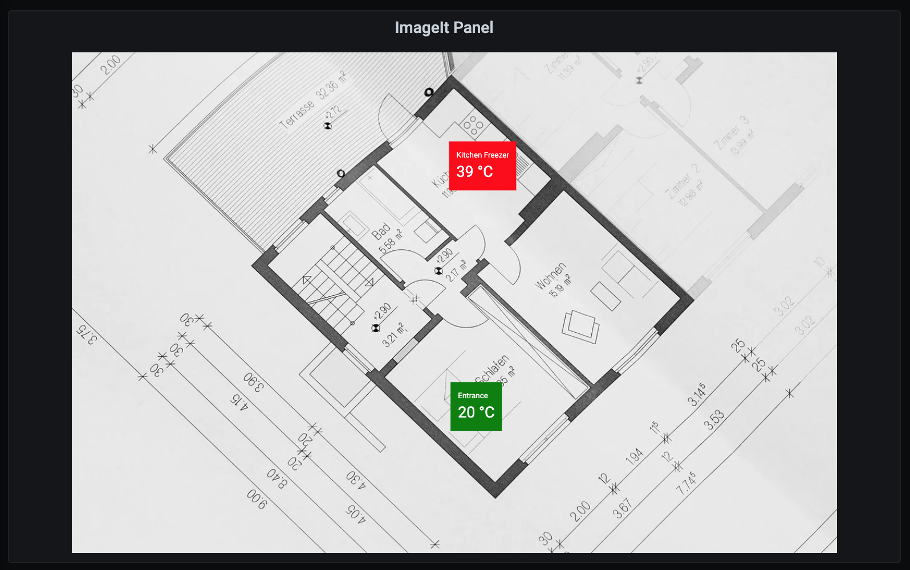

# Grafana Plugins - ImageIt

*20 June 2022. Update: 2022/07/06.*

* [用途](#use)

* [安裝方式、有無支援 ElasticSearch](#install)

* [範例](#example)

<h2 id="use">用途</h2>

允許使用者將測量顯示疊加在圖片上

<h2 id="install">安裝方式、有無支援 ElasticSearch</h2>

搜尋 Grafana Plugins 中的 ImageIt 並點擊 INSTALL 或打以下指令

    grafana-cli plugins install pierosavi-imageit-panel

*不支援 Grafana 9*

<h2 id="example">範例</h2>

