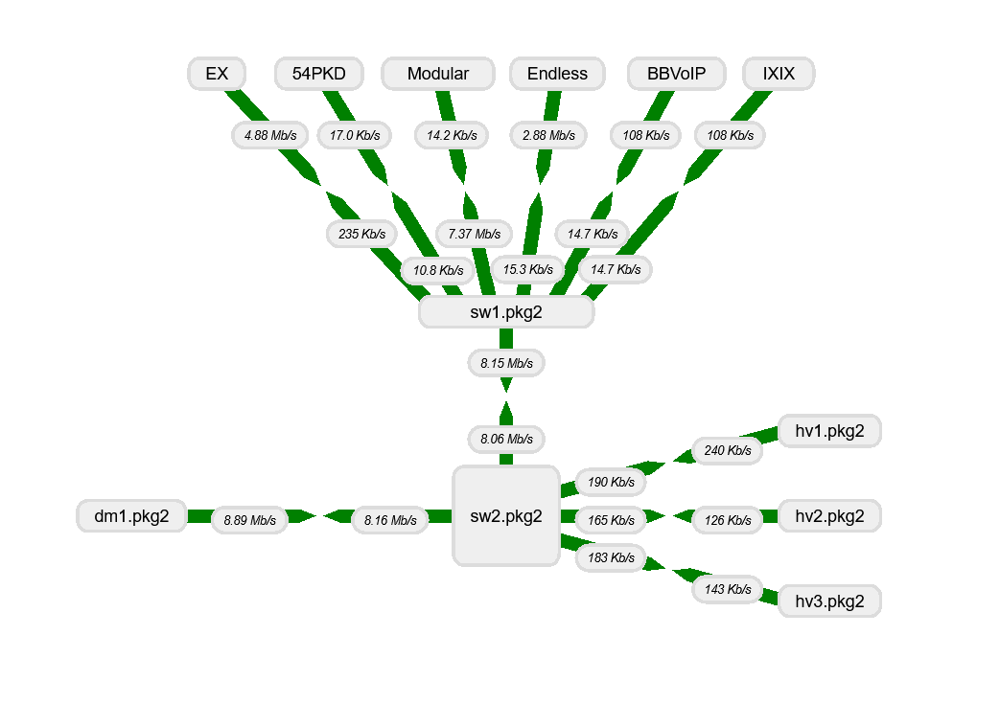

# Grafana Plugins - Network Weathermap

*20 June 2022. Update: 2022/06/30.*

* [用途](#use)

* [安裝方式、有無支援 ElasticSearch](#install)

* [範例](#example)

<h2 id="use">用途</h2>

網路天氣圖，顯示各網路傳輸速度與傳輸方向等

<h2 id="install">安裝方式、有無支援 ElasticSearch</h2>

建議直接在grafana套件中安裝

<h2 id="example">範例</h2>

