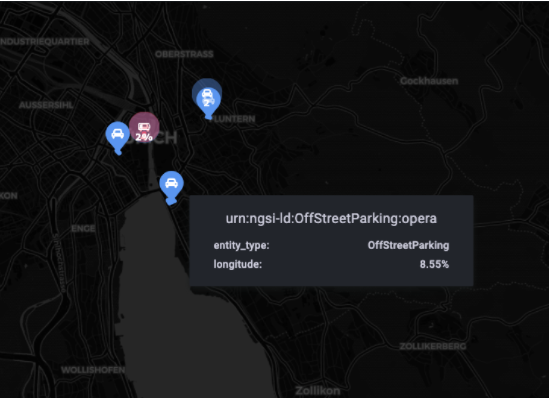

# Grafana Plugins - Orchestra Cities Map

*20 June 2022. Update: 2022/06/23.*

* [用途](#use)

* [安裝方式、有無支援 ElasticSearch](#install)

* [範例](#example)

<h2 id="use">用途</h2>

座標圖。支援 GeoJSON、圖標、圖標可顯示數據、自訂圖層等

<h2 id="install">安裝方式、有無支援 ElasticSearch</h2>

搜尋 Grafana Plugins 中的 Orchestra Cities Map 並點擊 INSTALL 或打以下指令

    grafana-cli plugins install boazreicher-mosaicplot-panel

<h2 id="example">範例</h2>

