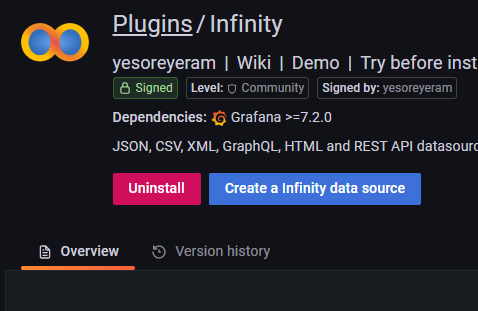
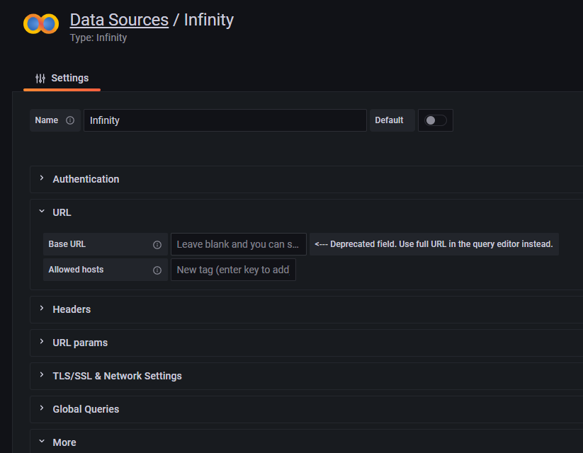
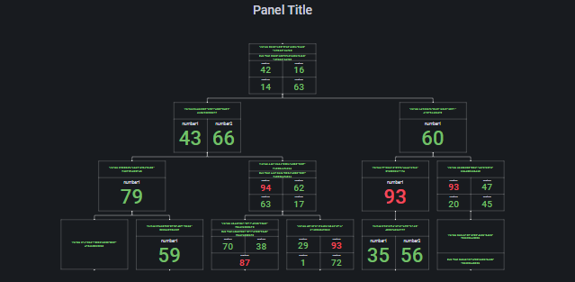

# Grafana Plugins - Phlowchart

*20 June 2022. Update: 2022/07/28.*

* [用途](#use)

* [安裝方式、有無支援 ElasticSearch](#install)

* [圖表產出教學](#teach)

<h2 id="use">用途</h2>

可用於從有向圖數據中呈現交互式流程圖。該面板依賴於 Infinity 數據源插件。

<h2 id="install">安裝方式、有無支援 ElasticSearch</h2>

搜尋 Grafana Plugins 中的 Phlowchart 並點擊 INSTALL 或打以下指令

    grafana-cli plugins install philipsgis-phlowchart-panel

無支援 ES，只支援 Infinity

<h2 id="teach">圖表產出教學</h2>

(1) 首先下載 Infinity 插件，並在 datasource 中加入此插件(但不用做任何設定)

(2) 進入dashboard，選擇 Infinity，並設定 Type 為 json 及 Source 為 inline

(3) 將以下

[edges](https://raw.githubusercontent.com/philips-labs/grafana-bpm-plugin/main/sample_data/edges.json)

[nodes](https://raw.githubusercontent.com/philips-labs/grafana-bpm-plugin/main/sample_data/nodes.json)

