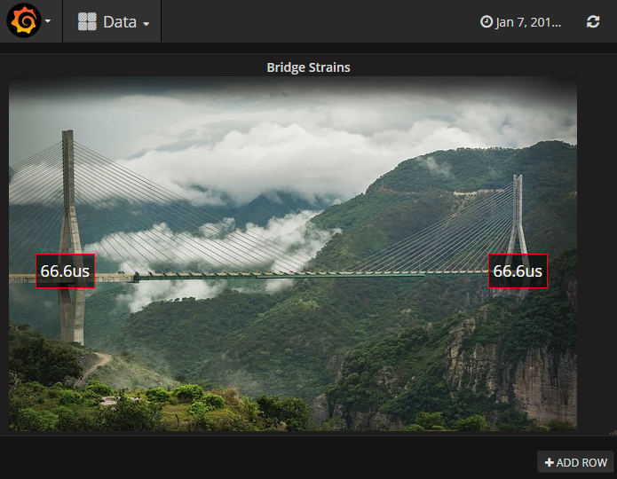

# Grafana Plugins - PictureIt

**目前已無更新，故無法使用**

*20 June 2022. Update: 2022/07/12.*

* [用途](#use)

* [安裝方式、有無支援 ElasticSearch](#install)

* [範例](#example)

<h2 id="use">用途</h2>

允許用戶將測量疊加在圖上，透過添加傳感器並將它們與指標聯繫起來

<h2 id="install">安裝方式、有無支援 ElasticSearch</h2>

搜尋 Grafana Plugins 中的 PictureIt 並點擊 INSTALL 或打以下指令

    grafana-cli plugins install bessler-pictureit-panel

<h2 id="example">範例</h2>

