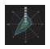
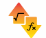

# Grafana 實作練習 - Plugins 篇

與 [Darrenli](https://github.com/Darrenli840214) 及 [hsiaotingg](https://github.com/hsiaotingg) 共同協作

*21 June 2022. Update: 2022/07/13.*

*Grafana version : 9.0.0*

* [實用 Grafana Plugins](#hotPlugins)
* [全 Grafana Plugins](#allPlugins)

<h2 id="hotPlugins">實用 Grafana Plugins</h2>

| Icon | Name | Icon | Name | Icon | Name |
| ---- | ---- | ---- | ---- | ---- | ---- |
|  | [Candlestick](https://github.com/StevenHsu22/Grafana/tree/plugins/Candlestick) |  | [FlowCharting](https://github.com/StevenHsu22/Grafana/tree/plugins/FlowCharting) |  | [Service Dependency Graph](https://github.com/StevenHsu22/Grafana/tree/plugins/Service_Dependency_Graph) |
|  |  |  |  |  |  |

<h2 id="allPlugins">全 Grafana Plugins</h2>

| Icon | Name | Icon | Name | Icon | Name |
| ---- | ---- | ---- | ---- | ---- | ---- |
| | [3D Globe Panel](https://github.com/StevenHsu22/Grafana/tree/plugins/3D_Globe_Panel)| |[ACE SVG](https://github.com/StevenHsu22/Grafana/tree/plugins/ACE_SVG)| | [AJAX](https://github.com/StevenHsu22/Grafana/tree/plugins/AJAX)|
| | [Alert List](https://github.com/StevenHsu22/Grafana/tree/plugins/Alert_List)| |[Analytics Panel](https://github.com/StevenHsu22/Grafana/tree/plugins/Analytics_Panel)| |[Annotation List](https://github.com/StevenHsu22/Grafana/tree/plugins/Annotation_List)|
|  | [Annotation Panel](https://github.com/StevenHsu22/Grafana/tree/plugins/Annotation_Panel) |  | [Annotations list](https://github.com/StevenHsu22/Grafana/tree/plugins/Annotations_list) |  | [Annunciator](https://github.com/StevenHsu22/Grafana/tree/plugins/Annunciator) |
|  | [Anodot](https://github.com/StevenHsu22/Grafana/tree/plugins/Anodot) |  | [Bar chart](https://github.com/StevenHsu22/Grafana/tree/plugins/Bar_chart) |  | [Bar gauge](https://github.com/StevenHsu22/Grafana/tree/plugins/Bar_gauge) |
|  | [Base64](https://github.com/StevenHsu22/Grafana/tree/plugins/Base64) |  | [Blendstat](https://github.com/StevenHsu22/Grafana/tree/plugins/Blendstat) |  | [Boom Table](https://github.com/StevenHsu22/Grafana/tree/plugins/Boom_Table) |
|  | [Boom Theme](https://github.com/StevenHsu22/Grafana/tree/plugins/Boom_Theme) |  | [Breadcrumb](https://github.com/StevenHsu22/Grafana/tree/plugins/Breadcrumb) |  | [Bubble Chart](https://github.com/StevenHsu22/Grafana/tree/plugins/Bubble_Chart) |
|  | [Button](https://github.com/StevenHsu22/Grafana/tree/plugins/Button) |  | [Button Panel](https://github.com/StevenHsu22/Grafana/tree/plugins/Button_Panel) |  | [CDF](https://github.com/StevenHsu22/Grafana/tree/plugins/CDF) |
|  | [Cal-HeatMap](https://github.com/StevenHsu22/Grafana/tree/plugins/Cal-HeatMap) |  | [Calander](https://github.com/StevenHsu22/Grafana/tree/plugins/Calander) |  | [Candlestick](https://github.com/StevenHsu22/Grafana/tree/plugins/Candlestick) |
|  | [Canvas](https://github.com/StevenHsu22/Grafana/tree/plugins/Canvas) |  | [Carpet plot](https://github.com/StevenHsu22/Grafana/tree/plugins/Carpet_plot) |  | [Clock](https://github.com/StevenHsu22/Grafana/tree/plugins/Clock) |
|  | [Colored SVG Panel](https://github.com/StevenHsu22/Grafana/tree/plugins/Colored_SVG_Panel) |  | [Compact Hostmap Panel](https://github.com/StevenHsu22/Grafana/tree/plugins/Compact_Hostmap_Panel) |  | [Comparison Panel](https://github.com/StevenHsu22/Grafana/tree/plugins/Comparison_Panel) |
|  | [D3 Gauge](https://github.com/StevenHsu22/Grafana/tree/plugins/D3_Gauge) |  | [Dashboard list](https://github.com/StevenHsu22/Grafana/tree/plugins/Dashboard_list) |  | [Datatable Panel](https://github.com/StevenHsu22/Grafana/tree/plugins/Datatable_Panel) |
|  | [Debug](https://github.com/StevenHsu22/Grafana/tree/plugins/Debug) |  | [Diagram](https://github.com/StevenHsu22/Grafana/tree/plugins/Diagram) |  | [Discrete](https://github.com/StevenHsu22/Grafana/tree/plugins/Discrete) |
|  | [Dynamic image panel](https://github.com/StevenHsu22/Grafana/tree/plugins/Dynamic_image_panel) |  | [Dynamic text](https://github.com/StevenHsu22/Grafana/tree/plugins/Dynamic_text) |  | [Echarts](https://github.com/StevenHsu22/Grafana/tree/plugins/Echarts) |
|  | [FlowCharting](https://github.com/StevenHsu22/Grafana/tree/plugins/FlowCharting) |  | [Gantt](https://github.com/StevenHsu22/Grafana/tree/plugins/Gantt) |  | [Gauge](https://github.com/StevenHsu22/Grafana/tree/plugins/Gauge) |
|  | [GeoLoop](https://github.com/StevenHsu22/Grafana/tree/plugins/GeoLoop) |  | [Geomap](https://github.com/StevenHsu22/Grafana/tree/plugins/Geomap) |  | [Graph old](https://github.com/StevenHsu22/Grafana/tree/plugins/Graph_old) |
|  | [Guided Tour](https://github.com/StevenHsu22/Grafana/tree/plugins/Guided_Tour) |  | [HTML](https://github.com/StevenHsu22/Grafana/tree/plugins/HTML) |  | [HTML graphics](https://github.com/StevenHsu22/Grafana/tree/plugins/HTML_graphics) |
|  | [Heatmap](https://github.com/StevenHsu22/Grafana/tree/plugins/Heatmap) |  | [HeatmapEpoch](https://github.com/StevenHsu22/Grafana/tree/plugins/HeatmapEpoch) |  | [Heatmap by labs](https://github.com/StevenHsu22/Grafana/tree/plugins/Heatmap_by_labs) |
|  | [Heatmap new](https://github.com/StevenHsu22/Grafana/tree/plugins/Heatmap_new) |  | [Hexmap](https://github.com/StevenHsu22/Grafana/tree/plugins/Hexmap) |  | [Histogram](https://github.com/StevenHsu22/Grafana/tree/plugins/Histogram) |
|  | [Histogram Labs](https://github.com/StevenHsu22/Grafana/tree/plugins/Histogram_Labs) |  | [Hourly heatmap](https://github.com/StevenHsu22/Grafana/tree/plugins/Hourly_heatmap) |  | [ImageIt](https://github.com/StevenHsu22/Grafana/tree/plugins/ImageIt) |
|  | [Influx_Admin](https://github.com/StevenHsu22/Grafana/tree/plugins/Influx_Admin) |  | [MapTrack3D](https://github.com/StevenHsu22/Grafana/tree/plugins/MapTrack3D) |  | [Matomo Tracker](https://github.com/StevenHsu22/Grafana/tree/plugins/Matomo_Tracker) |
|  | [Mosaic](https://github.com/StevenHsu22/Grafana/tree/plugins/Mosaic) |  | [Multistat](https://github.com/StevenHsu22/Grafana/tree/plugins/Multistat) |  | [Network Weathermap](https://github.com/StevenHsu22/Grafana/tree/plugins/Network_Weathermap) |
|  | [Orchestra Cities Icon Stat Panel](https://github.com/StevenHsu22/Grafana/tree/plugins/Orchestra_Cities_Icon_Stat_Panel) |  | [Orchestra Cities Map](https://github.com/StevenHsu22/Grafana/tree/plugins/Orchestra_Cities_Map) |  | [Organisations](https://github.com/StevenHsu22/Grafana/tree/plugins/Organisations) |
|  | [Pareto Chart](https://github.com/StevenHsu22/Grafana/tree/plugins/Pareto_Chart) |  | [Parity Report](https://github.com/StevenHsu22/Grafana/tree/plugins/Parity_Report) |  | [Percent plus](https://github.com/StevenHsu22/Grafana/tree/plugins/Percent_plus) |
|  | [PerfCurve](https://github.com/StevenHsu22/Grafana/tree/plugins/PerfCurve) |  | [PictureIt](https://github.com/StevenHsu22/Grafana/tree/plugins/PictureIt) |  | [Pie_Chart](https://github.com/StevenHsu22/Grafana/tree/plugins/Pie_Chart) |
|  | [Plotly](https://github.com/StevenHsu22/Grafana/tree/plugins/Plotly) |  | [Plotly panel](https://github.com/StevenHsu22/Grafana/tree/plugins/Plotly_panel) |  | [Polystat](https://github.com/StevenHsu22/Grafana/tree/plugins/Polystat) |
|  | [Progress List](https://github.com/StevenHsu22/Grafana/tree/plugins/Progress_List) |  | [Psychrometric Chart](https://github.com/StevenHsu22/Grafana/tree/plugins/Psychrometric_Chart) |  | [Radar_Graph](https://github.com/StevenHsu22/Grafana/tree/plugins/Radar_Graph) |
|  | [SCADAvis Synoptic Panel](https://github.com/StevenHsu22/Grafana/tree/plugins/SCADAvis_Synoptic_Panel) |  | [SVG](https://github.com/StevenHsu22/Grafana/tree/plugins/SVG) |  | [Sankey_Panel](https://github.com/StevenHsu22/Grafana/tree/plugins/Sankey_Panel) |
|  | [Scatter](https://github.com/StevenHsu22/Grafana/tree/plugins/Scatter) |  | [Separator](https://github.com/StevenHsu22/Grafana/tree/plugins/Separator) |  | [Service Dependency Graph](https://github.com/StevenHsu22/Grafana/tree/plugins/Service_Dependency_Graph) |
|  | [Shift Selector](https://github.com/StevenHsu22/Grafana/tree/plugins/Shift_Selector) |  | [Sierra Plot](https://github.com/StevenHsu22/Grafana/tree/plugins/Sierra_Plot) |  | [Singlestat](https://github.com/StevenHsu22/Grafana/tree/plugins/Singlestat) |
|  | [Singlestat_Math](https://github.com/StevenHsu22/Grafana/tree/plugins/Singlestat_Math) |  | [Stat](https://github.com/StevenHsu22/Grafana/tree/plugins/Stat) |  | [Status By Group Panel](https://github.com/StevenHsu22/Grafana/tree/plugins/Status_By_Group_Panel) |
|  | [Status_Panel](https://github.com/StevenHsu22/Grafana/tree/plugins/Status_Panel) |  | [Statusmap](https://github.com/StevenHsu22/Grafana/tree/plugins/Statusmap) |  | [Table](https://github.com/StevenHsu22/Grafana/tree/plugins/Table) |
|  | [Text](https://github.com/StevenHsu22/Grafana/tree/plugins/Text) |  | [Time series](https://github.com/StevenHsu22/Grafana/tree/plugins/Time_series) |  | [Timepicker Buttons Panel](https://github.com/StevenHsu22/Grafana/tree/plugins/Timepicker_Buttons_Panel) |
|  | [Topology Panel](https://github.com/StevenHsu22/Grafana/tree/plugins/Topology_Panel) |  | [Traceroute Map Panel](https://github.com/StevenHsu22/Grafana/tree/plugins/Traceroute_Map_Panel) |  | [TrackMap](https://github.com/StevenHsu22/Grafana/tree/plugins/TrackMap) |
|  | [Track_Map](https://github.com/StevenHsu22/Grafana/tree/plugins/Track_Map) |  | [TrafficLight](https://github.com/StevenHsu22/Grafana/tree/plugins/TrafficLight) |  | [Traffic Lights](https://github.com/StevenHsu22/Grafana/tree/plugins/Traffic_Lights) |
|  | [Tree View](https://github.com/StevenHsu22/Grafana/tree/plugins/Tree_View) |  | [Treemap](https://github.com/StevenHsu22/Grafana/tree/plugins/Treemap) |  | [Untimely](https://github.com/StevenHsu22/Grafana/tree/plugins/Untimely) |
|  | [Video](https://github.com/StevenHsu22/Grafana/tree/plugins/Video) |  | [Waterfall_Panel](https://github.com/StevenHsu22/Grafana/tree/plugins/Waterfall_Panel) |  | [Website Navigation](https://github.com/StevenHsu22/Grafana/tree/plugins/Website_Navigation) |
|  | [WindRose](https://github.com/StevenHsu22/Grafana/tree/plugins/WindRose) |  | [Word cloud](https://github.com/StevenHsu22/Grafana/tree/plugins/Word_cloud) |  | [Worldmap Panel](https://github.com/StevenHsu22/Grafana/tree/plugins/Worldmap_Panel) |
|  | [XY Chart](https://github.com/StevenHsu22/Grafana/tree/plugins/XY_Chart) |  | [ePict Panel](https://github.com/StevenHsu22/Grafana/tree/plugins/ePict_Panel) |  | [mapbox-panel](https://github.com/StevenHsu22/Grafana/tree/plugins/mapbox-panel) |
|  | [pyroscope-panel](https://github.com/StevenHsu22/Grafana/tree/plugins/pyroscope-panel) |  |  |  |  |

