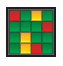

# Grafana 實作練習 - Plugins 篇

*21 June 2022. Update: 2022/06/29.*

*Grafana version : 9.0.0*

## Grafana Plugins

| Icon | Name | Icon | Name | Icon | Name |
| ---- | ---- | ---- | ---- | ---- | ---- |
| | [AJAX](https://github.com/StevenHsu22/Grafana/tree/plugins/AJAX)| |[Annotation Panel](https://github.com/StevenHsu22/Grafana/tree/plugins/Annotation_Panel)| |[Base64](https://github.com/StevenHsu22/Grafana/tree/plugins/Base64)|
|  | [Boom Theme](https://github.com/StevenHsu22/Grafana/tree/plugins/Boom_Theme) |  | [Button](https://github.com/StevenHsu22/Grafana/tree/plugins/Button) |  | [Calander](https://github.com/StevenHsu22/Grafana/tree/plugins/Calander) |
|  | [Clock](https://github.com/StevenHsu22/Grafana/tree/plugins/Clock) |  | [Colored SVG Panel](https://github.com/StevenHsu22/Grafana/tree/plugins/Colored_SVG_Panel) |  | [D3 Gauge](https://github.com/StevenHsu22/Grafana/tree/plugins/D3_Gauge) |
|  | [Dashboard_list](https://github.com/StevenHsu22/Grafana/tree/plugins/Dashboard_list) |  | [Discrete](https://github.com/StevenHsu22/Grafana/tree/plugins/Discrete) |  | [Gantt](https://github.com/StevenHsu22/Grafana/tree/plugins/Gantt) |
|  | [Heatmap](https://github.com/StevenHsu22/Grafana/tree/plugins/Heatmap) |  | [Histogram](https://github.com/StevenHsu22/Grafana/tree/plugins/Histogram) |  | [HTML_graphics](https://github.com/StevenHsu22/Grafana/tree/plugins/HTML_graphics) |
|  | [mapbox-panel](https://github.com/StevenHsu22/Grafana/tree/plugins/mapbox-panel) |  | [Mosaic](https://github.com/StevenHsu22/Grafana/tree/plugins/Mosaic) |  | [Orchestra Cities Map](https://github.com/StevenHsu22/Grafana/tree/plugins/Orchestra_Cities_Map) |
|  | [Parity Report](https://github.com/StevenHsu22/Grafana/tree/plugins/Parity_Report) |  | [PictureIt](https://github.com/StevenHsu22/Grafana/tree/plugins/PictureIt) |  | [Polystat](https://github.com/StevenHsu22/Grafana/tree/plugins/Polystat) |
|  | [pyroscope-panel](https://github.com/StevenHsu22/Grafana/tree/plugins/pyroscope-panel) |  | [SCADAvis Synoptic Panel](https://github.com/StevenHsu22/Grafana/tree/plugins/SCADAvis_Synoptic_Panel) |  | [Service Dependency Graph](https://github.com/StevenHsu22/Grafana/tree/plugins/Service_Dependency_Graph) |
|  | [Singlestat](https://github.com/StevenHsu22/Grafana/tree/plugins/Singlestat) |  | [Status Panel](https://github.com/StevenHsu22/Grafana/tree/plugins/Status_Panel) |  | [Text](https://github.com/StevenHsu22/Grafana/tree/plugins/Text) |
|  | [Timepicker Buttons Panel](https://github.com/StevenHsu22/Grafana/tree/plugins/Timepicker_Buttons_Panel) |  | [Track Map](https://github.com/StevenHsu22/Grafana/tree/plugins/Track_Map) |  | [TrafficLight](https://github.com/StevenHsu22/Grafana/tree/plugins/TrafficLight) |
|  | [Untimely](https://github.com/StevenHsu22/Grafana/tree/plugins/Untimely) |  | [Website Navigation](https://github.com/StevenHsu22/Grafana/tree/plugins/Website_Navigation) |  |  |
|  | [Annotations_list](https://github.com/StevenHsu22/Grafana/tree/plugins/Annotations_list) |  | [Bar_chart](https://github.com/StevenHsu22/Grafana/tree/plugins/Bar_chart) |  | [Bar_gauge](https://github.com/StevenHsu22/Grafana/tree/plugins/Bar_gauge) |
|  | [Candlestick](https://github.com/StevenHsu22/Grafana/tree/plugins/Candlestick) |  | [Canvas](https://github.com/StevenHsu22/Grafana/tree/plugins/Canvas) |  | [Debug](https://github.com/StevenHsu22/Grafana/tree/plugins/Debug) |
|  | [Gauge](https://github.com/StevenHsu22/Grafana/tree/plugins/Gauge) |  | [Geomap](https://github.com/StevenHsu22/Grafana/tree/plugins/Geomap) |  | [Heatmap_new](https://github.com/StevenHsu22/Grafana/tree/plugins/Heatmap_new) |
|  | [Histogram_Labs](https://github.com/StevenHsu22/Grafana/tree/plugins/Histogram_Labs) |  | [Network_Weathermap](https://github.com/StevenHsu22/Grafana/tree/plugins/Network_Weathermap) |  | [Time_series](https://github.com/StevenHsu22/Grafana/tree/plugins/Time_series) |
|  | [XY_Chart](https://github.com/StevenHsu22/Grafana/tree/plugins/XY_Chart) |  |  |  |  |
|  |  |  |  |  |

