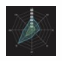
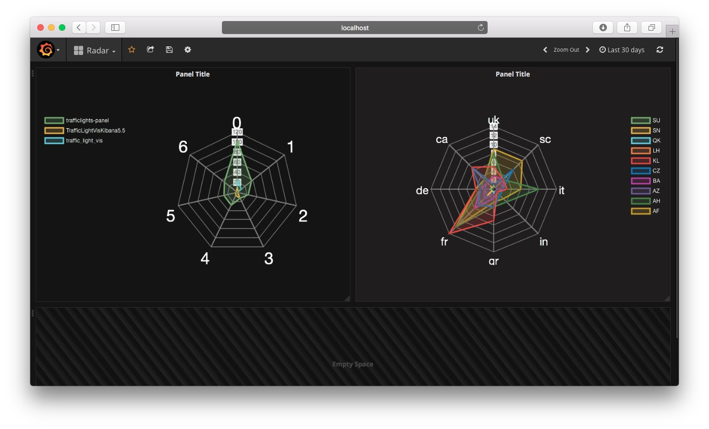

# Grafana Plugins - Radar Graph

*20 June 2022. Update: 2022/07/06.*

* [用途](#use)

* [安裝方式、有無支援 ElasticSearch](#install)

* [範例](#example)

<h2 id="use">用途</h2>

使用 Chart.JS 庫顯示雷達圖

<h2 id="install">安裝方式、有無支援 ElasticSearch</h2>

搜尋 Grafana Plugins 中的 Radar Graph 並點擊 INSTALL 或打以下指令

    grafana-cli plugins install snuids-radar-panel

*支援 ElasticSearch 5.5 也可使用 InfluxDB 1.3.6 / PostGreSQL / MariaDB*

<h2 id="example">範例</h2>

