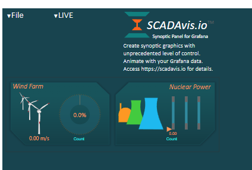

# Grafana Plugins - SCADAvis Synoptic Panel

*20 June 2022. Update: 2022/06/23.*

* [用途](#use)

* [安裝方式、有無支援 ElasticSearch](#install)

* [範例](#example)

<h2 id="use">用途</h2>

類似 SCADA 的圖形。使用 SCADAvis.io 提供了的 SVG 編輯器，用於創建使用 Grafana 數據進行動畫處理的圖形

<h2 id="install">安裝方式、有無支援 ElasticSearch</h2>

搜尋 Grafana Plugins 中的 SCADAvis Synoptic Panel 並點擊 INSTALL 或打以下指令

    grafana-cli plugins install scadavis-synoptic-panel

<h2 id="example">範例</h2>

