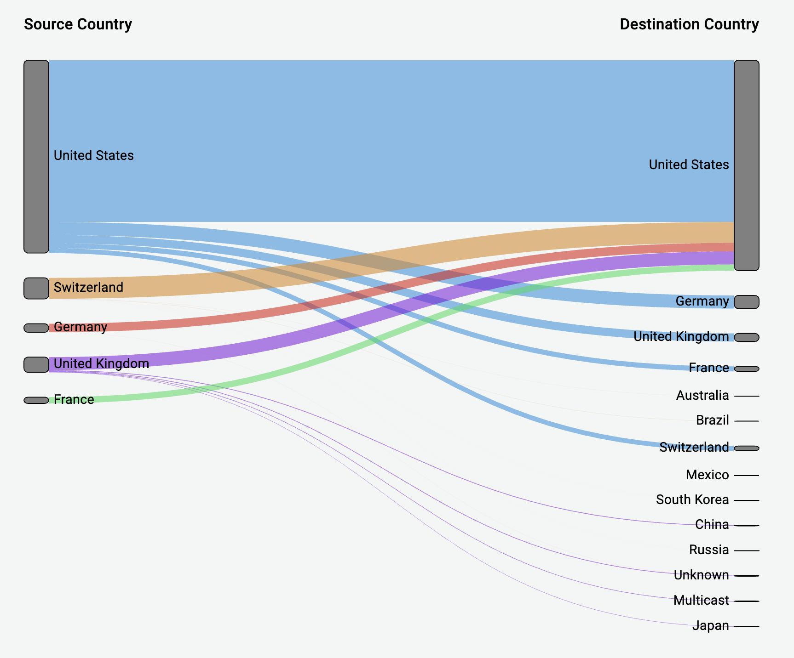

# Grafana Plugins - Sankey Panel 

*20 June 2022. Update: 2022/07/06.*

* [用途](#use)

* [安裝方式、有無支援 ElasticSearch](#install)

* [範例](#example)

* [實作練習](#do_example)

<h2 id="use">用途</h2>

適合可視化水流數據，並且水流的寬度將與所選指標成比例

<h2 id="install">安裝方式、有無支援 ElasticSearch</h2>

搜尋 Grafana Plugins 中的 Sankey Panel 並點擊 INSTALL 或打以下指令

    grafana-cli plugins install netsage-sankey-panel

<h2 id="example">範例</h2>

<h2 id="do_example">實作練習</h2>

