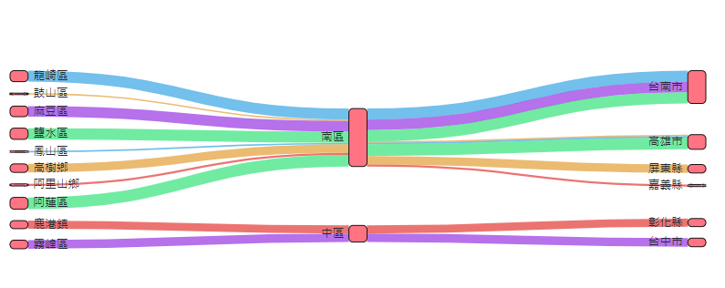

# Grafana Plugins - Sankey Panel 

*20 June 2022. Update: 2022/07/06.*

* [用途](#use)

* [安裝方式、有無支援 ElasticSearch](#install)

* [範例](#example)

* [實作練習](#do_example)

* [教學](#teach)

<h2 id="use">用途</h2>

適合可視化水流數據，並且水流的寬度將與所選指標成比例

<h2 id="install">安裝方式、有無支援 ElasticSearch</h2>

搜尋 Grafana Plugins 中的 Sankey Panel 並點擊 INSTALL 或打以下指令

    grafana-cli plugins install netsage-sankey-panel

<h2 id="example">範例</h2>

<h2 id="do_example">實作練習</h2>

<h2 id="teach">教學</h2>

教學製作者 [Darrenli840214](https://github.com/Darrenli840214)

1. 進入編輯儀表板畫面，於右方選擇Sankey Panel後，於Query欄位放入一個可量化的指標，兩個或以上不同的類別，指標可以輸入Lucene語法搜尋，如下圖

2. Sankey主要調整右方的Sankey Panel欄位

* Single Link color only ：只顯示一種顏色
* Node color ：種類節點的顏色
* Node width ：節點的寬度
* Node padding ：調整水流的厚度
* Layout iterations：調整水流整體的排列

