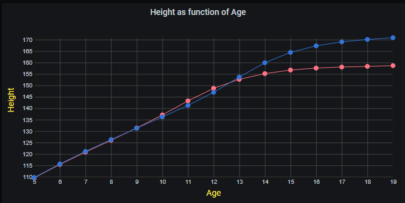

# Grafana Plugins - Scatter

*20 June 2022. Update: 2022/07/06.*

* [用途](#use)

* [安裝方式、有無支援 ElasticSearch](#install)

* [範例](#example)

<h2 id="use">用途</h2>

一定要使用“時間序列”格式的數據查詢，將數據繪製為一系列點。每個序列還可以選擇使用多個統計最佳擬合之一顯示回歸線

<h2 id="install">安裝方式、有無支援 ElasticSearch</h2>

搜尋 Grafana Plugins 中的 Scatter 並點擊 INSTALL 或打以下指令

    grafana-cli plugins install michaeldmoore-scatter-panel

<h2 id="example">範例</h2>

