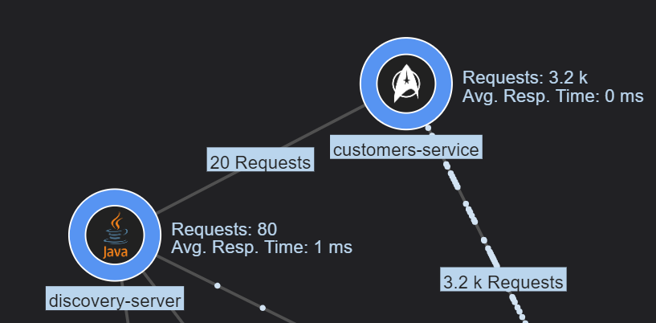
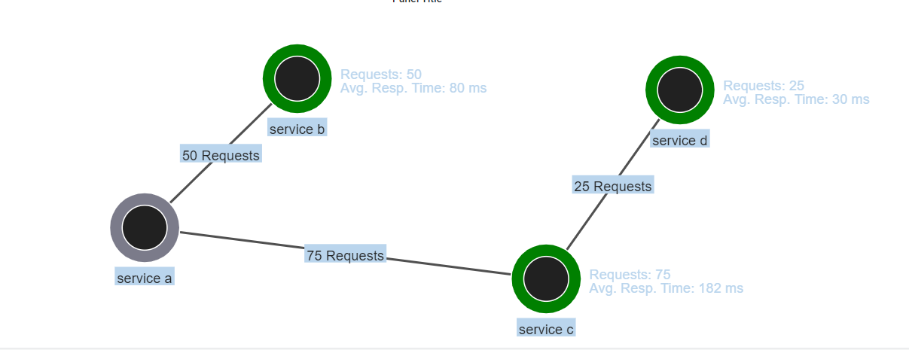
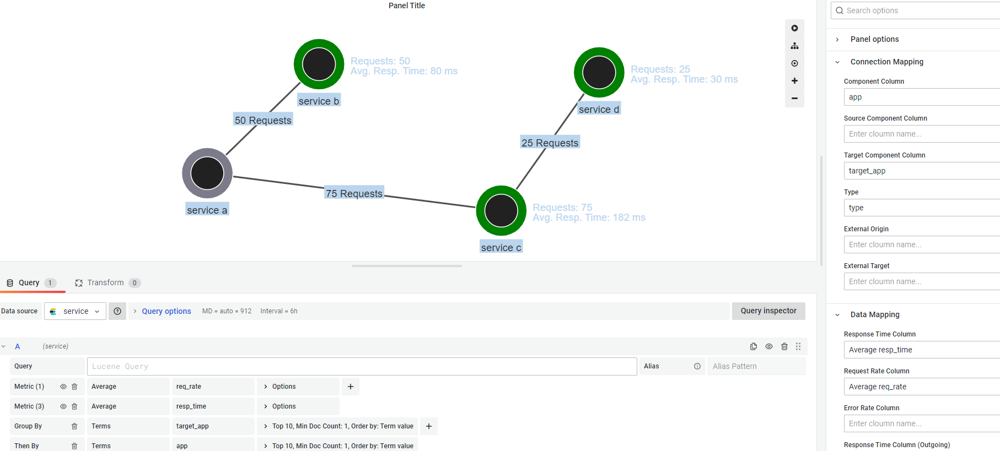

# Grafana Plugins - Service Dependency Graph

*20 June 2022. Update: 2022/07/19.*

* [用途](#use)

* [安裝方式、有無支援 ElasticSearch](#install)

* [範例](#example)

* [實作範例](#do_example)

* [教學文件](#teach)

<h2 id="use">用途</h2>

顯示服務之間基於度量的動態關係圖，如各服務和通信的響應時間、負載和錯誤率統計信息
(Web calls, database calls, message queues, LDAP calls, etc)

<h2 id="install">安裝方式、有無支援 ElasticSearch</h2>

搜尋 Grafana Plugins 中的 Service Dependency Graph 並點擊 INSTALL 或打以下指令

    grafana-cli plugins install novatec-sdg-panel

<h2 id="example">範例</h2>

<h2 id="do_example">實作範例</h2>

**目前尚無法固定**

<h2 id="teach">教學文件</h2>

[基本功能介紹教學](https://github.com/StevenHsu22/Grafana/blob/plugins/Service_Dependency_Graph/Service_Dependency_Graph.pdf)

