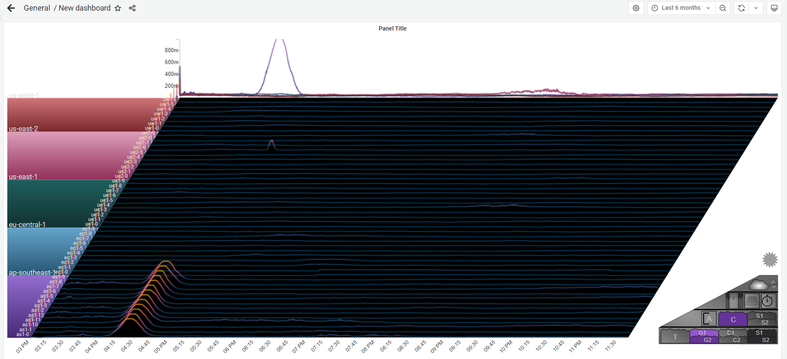

# Grafana Plugins - Sierra Plot 

*20 June 2022. Update: 2022/07/06.*

* [用途](#use)

* [安裝方式、有無支援 ElasticSearch](#install)

* [範例](#example)

* [實作範例](#do_example)

* [教學文件](#teach)

<h2 id="use">用途</h2>

將圖片進一步轉換為3D圖形，將數據顯著的區塊顯示隆起狀

<h2 id="install">安裝方式、有無支援 ElasticSearch</h2>

搜尋 Grafana Plugins 中的 Sierra Plot 並點擊 INSTALL 或打以下指令

    grafana-cli plugins install boazreicher-sierraplot-panel

<h2 id="example">範例</h2>

<h2 id="do_example">實作範例</h2>

[資料來源](https://raw.githubusercontent.com/boazreicher/sierra-plot/main/examples/data/test_servers.csv)

<h2 id="teach">教學文件</h2>

