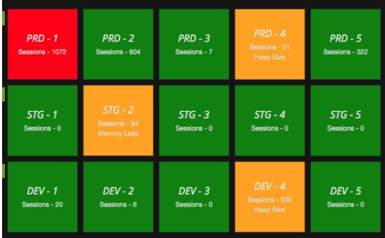

# Grafana Plugins - StatusPanel

*20 June 2022. Update: 2022/06/23.*

* [用途](#use)

* [安裝方式、有無支援 ElasticSearch](#install)

* [範例](#example)

<h2 id="use">用途</h2>

它與 Single Stat 面板很像，但它可以保存來自同一數據源的多個值。

可用於監控一堆服務器，並且追蹤每個服務器的多個統計信息

<h2 id="install">安裝方式、有無支援 ElasticSearch</h2>

搜尋 Grafana Plugins 中的 StatusPanel 並點擊 INSTALL 或打以下指令

    grafana-cli plugins install vonage-status-panel

<h2 id="example">範例</h2>

