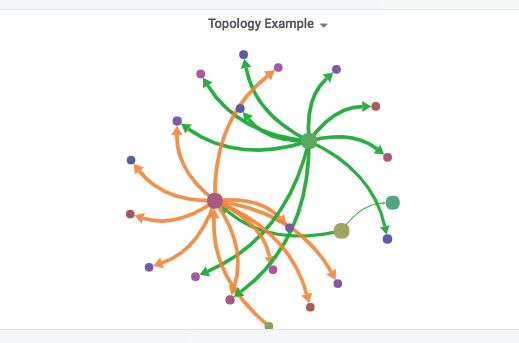

# Grafana Plugins - Topology Panel

**grafana 9.0.0 無法使用**

*20 June 2022. Update: 2022/07/12.*

* [用途](#use)

* [安裝方式、有無支援 ElasticSearch](#install)

* [範例](#example)

<h2 id="use">用途</h2>

是一種經過簡化及調整，只保留重要資訊的地圖(Ex.台北捷運路線圖)

<h2 id="install">安裝方式、有無支援 ElasticSearch</h2>

搜尋 Grafana Plugins 中的 Topology Panel 並點擊 INSTALL 或打以下指令

    grafana-cli plugins install gretamosa-topology-panel
    
只支援 grafana 5.x.x

<h2 id="example">範例</h2>

