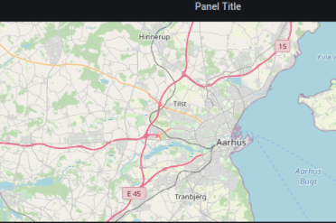

# Grafana Plugins - Track Map

*20 June 2022. Update: 2022/06/23.*

* [用途](#use)

* [安裝方式、有無支援 ElasticSearch](#install)

* [範例](#example)

<h2 id="use">用途</h2>

路徑地圖。將來自 GeoJSON 或 NGSIv2 的時間序列數據可視化為 Ant-path、Hexbin 或 Heatmap

<h2 id="install">安裝方式、有無支援 ElasticSearch</h2>

搜尋 Grafana Plugins 中的 Track Map 並點擊 INSTALL 或打以下指令

    grafana-cli plugins install alexandra-trackmap-panel

*目前點此套件會報錯*

<h2 id="example">範例</h2>

