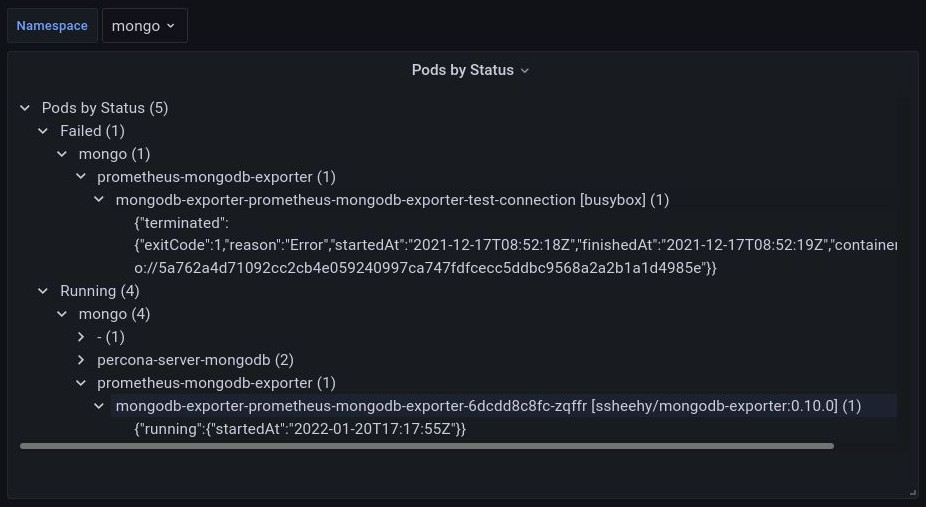
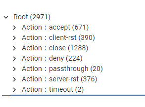
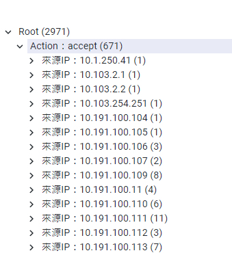
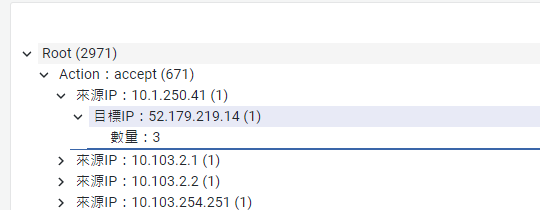
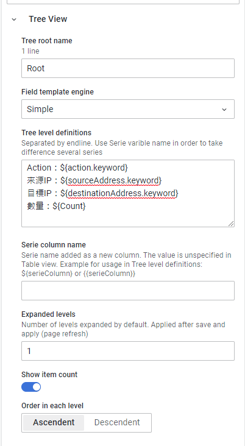
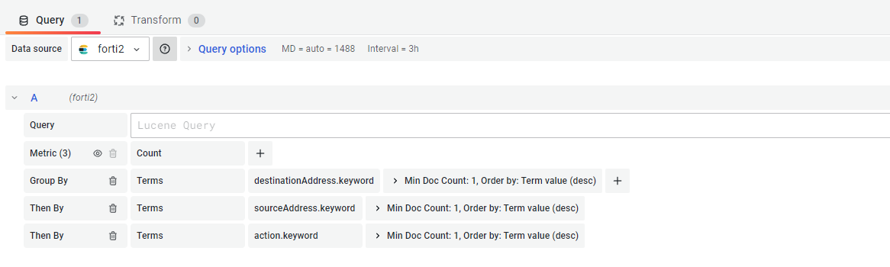

# Grafana Plugins - Tree View

*20 June 2022. Update: 2022/07/20.*

* [用途](#use)

* [安裝方式、有無支援 ElasticSearch](#install)

* [範例](#example)

* [實作範例](#do_example)

* [教學文件](#teach)

<h2 id="use">用途</h2>

顯示由數據來源提供的記錄樹

<h2 id="install">安裝方式、有無支援 ElasticSearch</h2>

搜尋 Grafana Plugins 中的 Tree View 並點擊 INSTALL 或打以下指令

    grafana-cli plugins install pgillich-tree-panel

*可支援 ES，也支援 JSON API 數據源*

<h2 id="example">範例</h2>

<h2 id="do_example">實作範例</h2>

<h2 id="teach">教學文件</h2>

[Tree View 教學文件](https://github.com/StevenHsu22/Grafana/blob/plugins/Tree_View/Tree_View.pdf)
