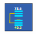

# Grafana Plugins - ePict Panel

*20 June 2022. Update: 2022/07/06.*

* [用途](#use)

* [安裝方式、有無支援 ElasticSearch](#install)

* [範例](#example)

* [實作練習](#do_example)

<h2 id="use">用途</h2>

透過URL連結來顯示圖像，可搭配即時指標顯示值

<h2 id="install">安裝方式、有無支援 ElasticSearch</h2>

搜尋 Grafana Plugins 中的 ePict Panel 並點擊 INSTALL 或打以下指令

    grafana-cli plugins install larona-epict-panel

<h2 id="example">範例</h2>

